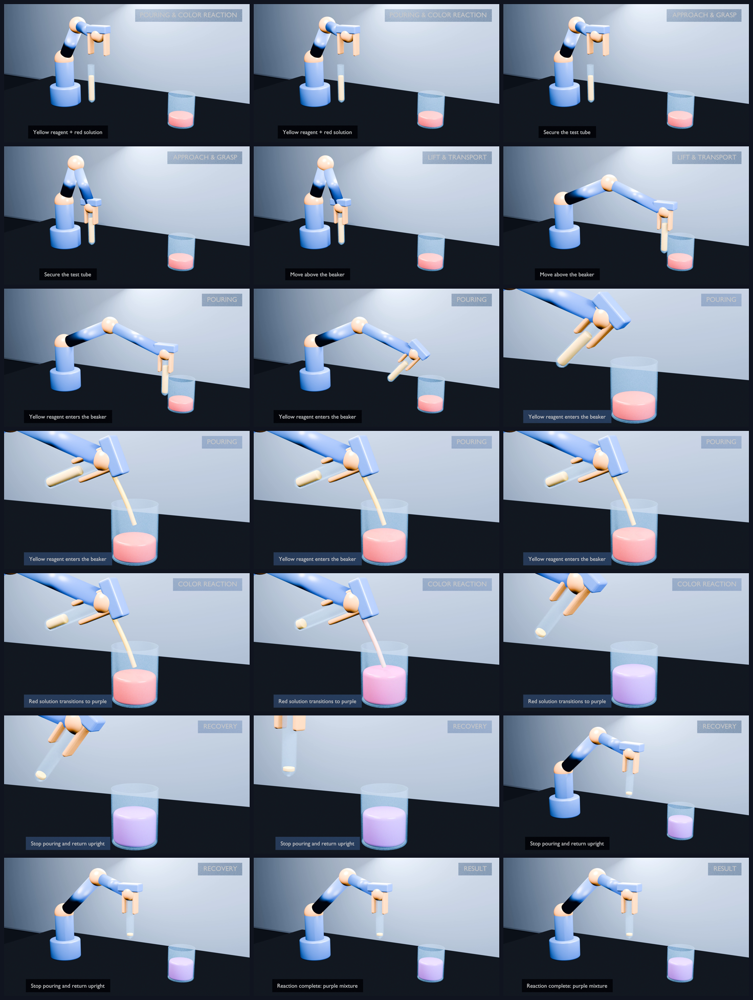

# Robot Pour Color Reaction

A reproducible Blender visual prototype in which a robot arm picks up a test tube, pours yellow reagent into red liquid, and presents a red-to-purple reaction.

> This is a deterministic visual prototype, not an Isaac Sim physics simulation, a CuRobo-validated trajectory, CFD, or a real chemical-reaction model.

## Final result

- [Watch the 15-second P2 video](blender_demo/output/p2/pour_color_reaction_p2.mp4)
- [Open the final Blender project](blender_demo/output/p2/pour_color_reaction_p2.blend)
- [Read the final acceptance report](docs/pour_color_reaction_p2_report.md)
- [Read the SimBox/Isaac Sim migration design](docs/pour_color_reaction_simbox_migration.md)



Verified delivery properties:

- Blender 5.2.1 LTS
- H.264/yuv420p, 1920×1080, 30 FPS
- 450 decoded frames, 15.000 seconds
- seven labeled task phases
- deterministic wide/close-up/wide camera sequence
- 21 final-video QA frames, with no decode errors or detected black frames

## Task sequence

```text
establish scene
→ approach and grasp
→ lift and transport
→ pour yellow reagent
→ transition red solution to purple
→ recover the test tube
→ present the result
```

The visuals are generated procedurally from JSON configuration and Blender Python. The source-liquid level, pour stream, target-liquid level, reaction color, robot pose, camera cuts, phase labels, and captions are synchronized through a frozen frame contract.

## Reproduce the final video

Requirements:

- Blender 5.2.1 LTS or a compatible Blender version
- FFmpeg available on `PATH`
- sufficient local rendering access; the verified macOS run used Blender's Metal-capable environment

From the repository root:

```bash
/Applications/Blender.app/Contents/MacOS/Blender \
  --background \
  --factory-startup \
  --python blender_demo/scripts/build_demo.py \
  -- \
  --config blender_demo/config/pour_color_reaction.json \
  --presentation-config blender_demo/config/presentation.json \
  --reaction-closeup \
  --artifact-stem pour_color_reaction_p2 \
  --output-dir blender_demo/output/p2 \
  --render-animation
```

The render command rebuilds the scene from a factory-startup file, validates its structural and animated states, saves the `.blend`, renders frames 1–450, and encodes the MP4.

## Repository layout

```text
blender_demo/
├── config/              # task, timing, color, and presentation contracts
├── scripts/             # procedural scene, robot, liquid, camera, and QA code
└── output/p2/           # final .blend, MP4, manifest, and QA frames
docs/
├── pour_color_reaction_p2_report.md
├── pour_color_reaction_simbox_migration.md
└── development plans and wave reports
```

Detailed commands and module contracts are documented in [blender_demo/README.md](blender_demo/README.md).

## Engineering decisions

- The Blender implementation favors deterministic animation over fluid simulation so the interview task is reproducible on the available Apple Silicon machine.
- Presentation labels are native camera-anchored Blender text rather than post-processing overlays.
- A dedicated close-up camera covers pouring and color transition while the wide camera preserves the complete robot story.
- The migration design maps the same state machine to the existing InternDataEngine SplitAloha pour-task structure: Nimbus orchestration, SimBox/Isaac Sim execution, CuRobo motion planning, PhysX particles, and LMDB logging.

## Attribution

This project was created in response to an interview assignment referencing [InternRobotics/InternDataEngine](https://github.com/InternRobotics/InternDataEngine). No InternDataEngine source code or task assets are redistributed in this standalone repository. See [ATTRIBUTION.md](ATTRIBUTION.md) for details.

## License

The original code and documentation in this repository are available under the [MIT License](LICENSE). Third-party projects and product names remain subject to their own terms.
